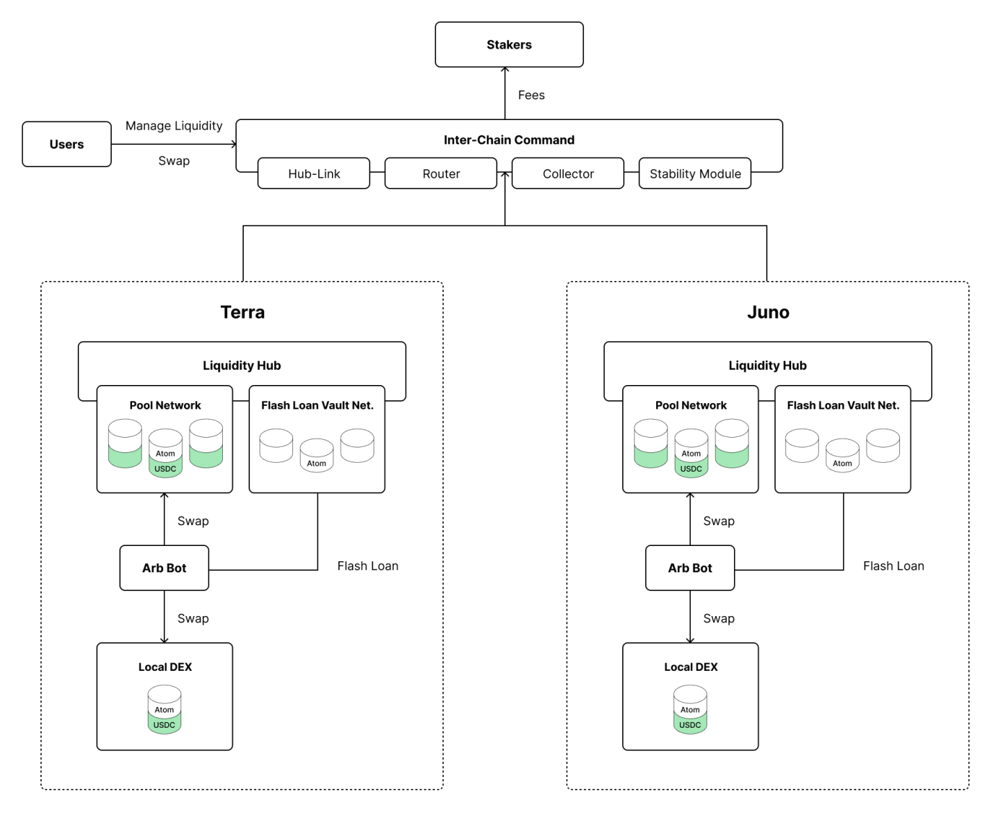

# Architecture

The White Whale protocol consists of 2 main components: the Liquidity Hubs and the Interchain Command.

<figure><figcaption>
Migaloo's Architecture
</figcaption></figure>

Detailed information about the functionalities of all components can be found on the [litepaper](https://whitewhale.money/LitepaperV2.pdf).
