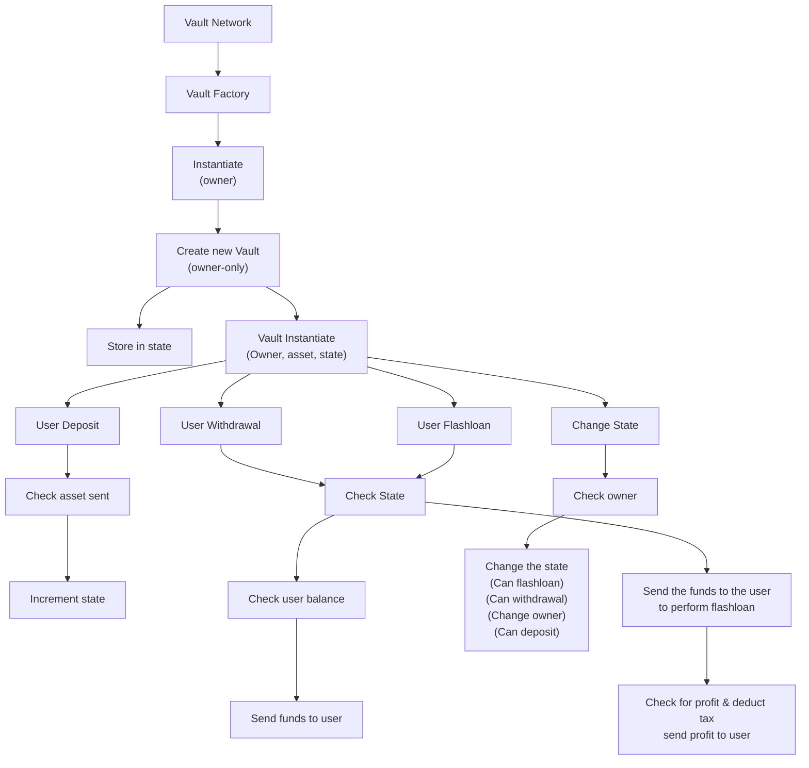

# Vault Network

The Vault Network is a WW-controlled collection of single asset vaults that bots use to access flashloan capital for arbitrage, 
liquidation, and other DeFi uses. By using the Flash Loan Vaults, arbitrage and liquidations happen locally in a 
capital-efficient manner and without capital requirements. That is, each arbitrageur or liquidator will no longer need 
their own capital on each local chain waiting idly to arb or to liquidate because they can access a flash loan for their 
capital needs. When an arbitrage opportunity arises, an arbitrageur takes a flash loan, arbs the local dex price versus 
the WW pool, and then pays back the loan plus the flash loan fee. The arbitrageur then keeps the profit without having 
used any of their own capital.

Depositors of tokens into flash loan vaults benefit from fees paid when their vault is accessed for flash loans; 
the greater the volume, the more fees generated. Flash loan vaults are a great source of yield with no impermanent loss.

The code for the vault network can be found [here](https://github.com/White-Whale-Defi-Platform/migaloo-core/tree/main/contracts/liquidity_hub/vault-network).

## Contracts

| Name                                                                                                                            | Description                   |
| ------------------------------------------------------------------------------------------------------------------------------- | ----------------------------- |
| [`vault_factory`](https://app.gitbook.com/o/fVZwd36itixTM6EMRcZt/s/PtAatYv3uVRxf7beAOPp/liquidity-hub/overview-2/vault-factory) | Factory used to create vaults |
| [`vault`](https://app.gitbook.com/o/fVZwd36itixTM6EMRcZt/s/PtAatYv3uVRxf7beAOPp/liquidity-hub/overview-2/vault)                 | Vault contract                |
| [`vault_router`](https://app.gitbook.com/o/fVZwd36itixTM6EMRcZt/s/PtAatYv3uVRxf7beAOPp/liquidity-hub/overview-2/vault-router)   | Makes taking flashloans easy  |

### Graphic Overview

