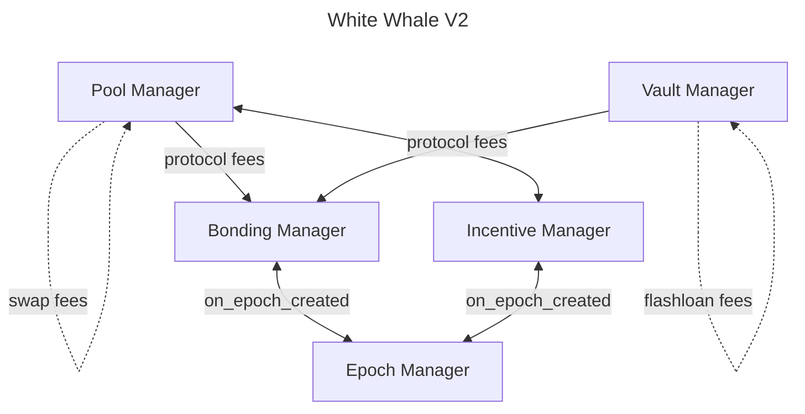

# Summary of Smart Contracts

## V2 Architecture

White Whale V2 is the next iteration of the White Whale protocol V1. Besides minor yet impactful tweaks, functionality wise V2
hasn't changed much from V1. The main difference is the architecture, which makes it easier to integrate with to other
protocols. In V1, the protocol used multiple contracts which makes it complex, factories spawning other contracts and so on.
In V2, the protocol has been simplified significantly and built around singleton contracts. So to get an idea, V1 had 14+ contracts,
while V2 has only 5 contracts.

The following is the V2 architecture, and a general description of each contract:

The direction of the arrows represents the dependencies between the contracts.

### Epoch Manager

The Epoch Manager is the contract that manages the epochs in the protocol. Its single responsibility is to create the epochs,
which are used by the Incentive and Bonding Managers for distributing incentives and fees, and other contracts in the 
ecosystem are welcome to use it as a unit of time. The Epoch Manager implements hooks, meaning contracts can get 
registered to be called when a new epoch is created. So for example, the **Incentive** and **Bonding** Managers depend on 
the Epoch Manager to calculate rewards and fees based on epochs.

The Epoch Manager is permissionless, meaning anyone can create an epoch once the current one has expired. The epoch duration 
is set on instantiation. There are a few mechanisms in place on other contracts of the protocol to ensure epochs are created.

### Pool Manager

The Pool Manager is the contract that manages the pools in the protocol. It is responsible for creating pool and handling
swaps, both with single and multiple hops. Pool creation is **permisionless**, meaning anyone can create a pool as long 
as the pool creation fee is paid, even allowing for duplicated pools as each pool has its own unique identifier.  

The Pool Manager is inspired in Uniswap V4, where all pools are held within the same contract. This allows for gas savings
when swapping between pools, and also allows for more efficient routing.

There are different fees associated with the Pool Manager:

- **Swap Fee:** fees that are charged on every swap and stay in the pool to reward liquidity providers. These are 
collected on the output token, meaning if the swap is from token A to token B, the fee is collected in token B.
- **Protocol Fee:** a portion of the fees collected on swaps that are sent to the Bonding Manager for distribution among 
the users that bond tokens. These are collected on the output token, meaning if the swap is from token A to token B, 
the fee is collected in token B.
- **Burn Fee:** fees that are burned on every swap. This only makes sense for non-IBC tokens, as IBC tokens are just a 
receipt of the original token and burning them doesn't decrease the total supply of the original token.
- **Osmosis Fee:** if the pool manager is deployed on Osmosis, there's a portion of the swap fees that are sent to the
Osmosis community pool.

The Pool Manager depends on both the Incentive and Bonding Managers, as the protocol fees collected on swaps are sent to 
the Bonding Manager as discussed above.

When a user deposits liquidity into the Pool Manager, it has the option to lock the LP tokens in the Incentive Manager, 
which is why the Pool Manager depends on the Incentive Manager. With LP tokens locked, the user will earn not only swap 
fees but also incentives on the given pool.

The Pool manager supports xyk and stableswap pools, and the user can choose which type of pool to create.

### Vault Manager

The Vault Manager is the contract that manages the vaults in the protocol. It is responsible for creating vaults and performing
flashloan operations. Vault creation is permissionless, meaning anyone can create a vault if the fee is paid, allowing 
duplicated vaults to be created as every vault has a unique identifier. The Vault Manager depends on the Bonding Manager,
as that's where the flashloan fees are sent for distribution.

Flashloans are used to perform arbitrage operations, mostly by bots. When a flashloan is taken, funds are taken from one 
of the vaults to perform the transactions the user/bot desires, then the funds are returned to the vault with a fee. If the 
user/bot fails to pay back the used funds plus the fee, the operation will be reverted as if nothing happened.

Like in the Pool Manager, there are different fees associated with the Vault Manager:

- **Flashloan Fee:** fees that are charged on every flashloan and stay in the vault to reward liquidity providers.
- **Protocol Fee:** a portion of the fees collected on flashloans that are sent to the Bonding Manager for distribution 
among the users that bond tokens.

### Incentive Manager

The Incentive Manager is the contract that manages the incentives in the protocol. It is responsible for creating and
distributing incentives on pools. Incentive creation is permissionless, meaning anyone can create an incentive if the fee is paid.

Incentives can be created, expanded or closed. Only a certain amount of incentives can be created per pool (LP). If there 
are more active incentives than allowed, the user will have to wait for an incentive to expire before creating a new one. 
Only the owner of the contract or the creator of the incentive can close the incentive at any point. However, once an 
incentive expires, meaning, it has reached its maturity date, the contract will automatically close it if someone tries 
to create a new incentive. Before the incentive expires, the creator can expand it with more funds if desired, extending the 
duration of the incentive. **Note:** when expanding an incentive, the amount of tokens sent needs to be a multiple of the 
initial amount.

Once an incentive is closed, the remaining funds are returned to the creator, if there's any left.

The Incentive Manager depends on the Epoch Manager, as incentives are distributed based on epochs. With every epoch, a user
with a position can claim their share of the rewards.

Positions can be created, expanded and closed. Creating a position means locking LP tokens in the Incentive Manager, which 
will grant the user a share of the rewards for the given pool. When a position is created, the user must specify an unlocking 
period, which is the time it takes in seconds to unlock the position. So if the user wants to withdraw its LP tokens, it needs 
to close the position so the unlocking period starts ticking. Once the unlocking period is over, the user can withdraw the LP.

Expanding a position means adding more LP tokens to the existing position. It is worth mentioning that closing a position 
can be done partially or fully. If the user wants to withdraw only a portion of the LP tokens, it can do so. The LP tokens 
that are being unlocked don't earn rewards, only the locked ones do.

### Bonding Manager

The Bonding Manager is the contract that manages the bonding in the protocol. It is responsible for bonding eligible tokens, 
usually LSTs, and distributing the fees generated by the pools and vaults among the users that bond tokens. The Bonding 
Manager depends on the Epoch Manager, as the rewards distribution is done based on epochs.

Once the user bonds tokens, it will start earning rewards from the next epoch based on the protocol fees generated by 
the pools and vaults, which also includes the fee taken to create a pool, vaults and incentives. The user can unbond at 
any time, partially or fully, but only the bonded tokens will earn rewards. Once the unbonding period finishes, the user 
can withdraw the tokens.

To avoid dead capital harming the protocol, there is a defined number of Reward Buckets that are active at a given point, 
set on instantiation. This parameter is referred to as grace period. One Reward Bucket is created for each epoch, and once 
the grace period is reached, the available rewards sitting idle in the "expiring" Reward Bucket are transferred to the 
newly created Reward Bucket. This way, the rewards are always circulating among the active users.

For the Bonding Manager to perform WHALE buybacks, Swap Routes need to be added to the Pool Manager. Ideally, the best 
route to swap a token into another should be calculated dynamically, but this can be computationally unfeasible to perform
on a smart contract, perhaps for the future. These routes dictate how to swap protocol fees to WHALE.

On a more technical note, if someone tries to bond or unbond tokens and there are pending rewards to be claimed by the user, 
the contract will automatically claim the rewards before proceeding with the bonding or unbonding operation. Additionally, 
if there are pending epochs to be created, the contract will automatically create them before proceeding with the bonding 
to guarantee the right amount of rewards are distributed.
